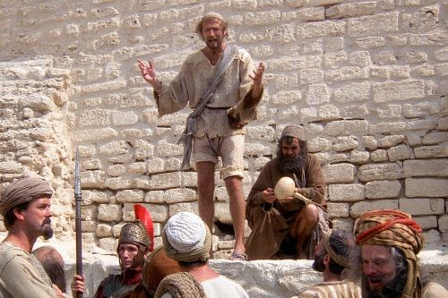

<h1>Brian Cohen(aus Monty Pythons Live of Brian)</h1>

Aus Wikipedia: Der naive und unauffällige Brian, zur selben Zeit wie Jesus geboren, wird durch Missverständnisse gegen seinen Willen als Messias verehrt.
Brian, der besagten Jesus Christus immer wieder einmal getroffen hat, ohne ihm größere Aufmerksamkeit zu schenken,
schließt sich der Volksfront von Judäa an, einer desolaten Bande von Möchtegern-Terroristen, die gegen die römischen Besatzer aufbegehren.
Durch eine skurrile Nacht und Nebel-Aktion wird Brian dann plötzlich wider Willen zu einer Art Volksheld, doch dummerweise veranstalten die Römer daraufhin
eine wilde Hatz auf alle Mitglieder der Volksfront. Brian kann nur entkommen, weil er sich an einer Straßenecke als Prediger ausgibt.
Wie es der Zufall will, scharen sich bald etliche Neugierige um ihn, und ehe er sich versieht, hat er auch schon eine ganze Schar Jünger, die ihn für den wahren Messias halten.
Damit nehmen das Unheil und das Chaos ihren endgültigen Lauf. Und als Brian, dem die ganze Geschichte einfach nur fürchterlich lästig ist, dann auch noch festgenommen wird,
scheint sein Schicksal besiegelt. Da er sich gegen die römischen Besatzer engagiert, findet er schließlich in einer Massenkreuzigung sein Ende.

Schauspieler:
Brian Cohen, Schwanzus Longus, Weiser aus dem Morgenland 	Graham Chapman	
Pontius Pilatus, Francis, Ex-Leprakranker, „Rübennase", 
langweiliger Prophet, Nisus Wettus, Weiser aus dem Morgenland	Michael Palin	
Reg, Centurio, Hoherpriester, Weiser aus dem Morgenland        	John Cleese	
Mutter Cohen, Eremit, Simon von Cyrene                                          	Terry Jones	
Stan (genannt „Loretta"), Mr. Cheeky, Bartverkäufer,
Gefängniswärter                                                                                    	Eric Idle	
Blut-und-Donner-Prophet, Gefängniswärter                                        	Terry Gilliam